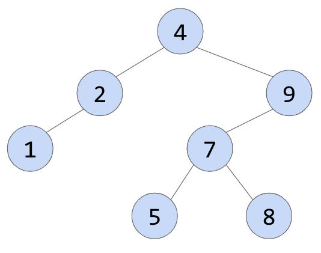

# Sets

Sets are a very efficient data structure to store a common group of values like a vector may, but one of the key differences is that a set doesn’t contain duplicates.

Sets are an associative data structure, which means in part that the elements are not stored sequentially and therefore there is no index to look up a value in a set. Instead, sets are stored in a way that makes searching for elements very quick and efficient.

## Basic Sets

C++ sets are great data structures either on their own or combined with other data structures. As mentioned earlier, sets have two key features that distinguish them from vectors: they have no duplicates, and searches for elements in the set are done in a binary search fashion (as opposed to a vector’s linear search).

### Creating a Set

Sets are a part of the C++ standard library but do need an include statement when using them.
```c++
#incluce <set>
```

Creating a set is very similar to other data structures. They can either be declared empty or with initial values.
```c++
set<int> numbers { 1, 2, 3, 4};

set<string> fruit;
```

### Inserting Into a Set

Inserting into a set is relatively straightforward, but interpreting the insert return command is a little more complicated. To insert into a set, you use the `insert(value)` command, for example:
```c++
fruit.insert("apple");
```

Since a set cannot contain duplicates, it is possible that a value already existed in the set. If it does exist, the insert will not add the new value. To find out if a value already existed and whether the new value was added, you need to look at the return value for the insert command.

The insert command return value is a `pair`, with the first value of the pair pointing to either the location of the new element or the location of the existing element if it already was in the set. It uses an `iterator` to point to that location.

The second element of the pair is a `boolean` value representing whether the new value was added. If it was added, this value will be true.

The basic form of the insert statement with a return value being stored as a variable would look like this:
```c++
pair<iterator, bool> varName = setName.insert(value);
```

Using the example above, you would have something like this:
```c++
pair<set<string>::iterator, bool> rtrn = fruit.insert("apple");
```

You can then interpret the return value for use later. For example, if you wanted to determine if the new value was not already in the set, you could use a conditional statement:
```c++
if (rtrn.second) {
    cout << "Value added! << endl;
}
```

Alternatively you can skip creating the return variable and just interpret the return value directly:
```c++
if (fruit.insert("apple").second) {
    cout << "Value added! << endl;
}
```

### Searching a Set

As mentioned above, one of the great advantages of a set is that it can be searched quickly. Behind the scenes, sets are stored in a binary tree-like format, which allows for a search to traverse the tree and find an element quickly.

To find an element in a set, you will use the `find` command. The find command returns an iterator that points to the element. If the element is not found, the find command will point to the end position of the set.

Here is an example of a search:
```c++
if (number.find(3) != numbers.end()) {
    cout << "The number is found." << endl;
}
```

### Other Useful Set Functions

As you saw with other data structures such as stacks and queues, sets have a limited number of functions. In addition to the find and insert functions, there are a few others that you may come across.

Here are the most commonly used set functions:

|Function|Return Type|Description|
|-----------|-----------|-----------|
|`insert(value)`|`pair`|Inserts element into set. Returns position of element and bool to indicate whether the element was inserted.|
|`find(value)`|`iterator`|Searches for an element and returns the position of the element. Returns the end position if not found.|
|`empty()`|`bool`|Returns true if the set is empty, false otherwise.|
|`size()`|`int`|Returns the size of the set.|
|`erase(iterator)`|`void`|When passed an iterator position, erase will remove that element from a set.|
|`clear()`|`void`|Removes all elements from the set.|
|`begin()`|`iterator`|Returns the beginning position of the set.|
|`end()`|`iterator`|Returns the end position of a set.|

### Try This Example

<iframe src="https://replit.com/@Poston/522-Basic-Sets#main.cpp?embed=true" width="600" height="400"></iframe>

## Iterating Through a Set

As mentioned before, sets do not have an index value and are not stored in a sequential order. As a result, a standard for loop from zero to less than the length is not possible.

Instead, traversing a set is possible using an iterator.

### For Loop Traversal

Like using an iterator for a vector, you can set up an iterator to iterate a set.
```c++
set<int> nums {2, 8, 4, 9};
for (set<int>::iterator itr = nums.begin(); itr != nums.end(); itr ++){
    cout << *itr << endl;
}
```

Notice in this example the iterator variable, `itr`, is declared and initialized inline. Each time through the loop, the iterator will point to a different value. You can then retrieve that value using the dereference operator, `*`.

### Traversal Order

So what order will it print in? As mentioned earlier, sets are stored in a version of a binary tree. In a binary tree, new values are inserted in order.

Here is an example of a tree. The first member of the tree would be 4. The second member was either 2 or 9. Since the 9 is greater than the 4, it is inserted to the right. If the next value is 7, then it goes right since it is greater than 4, but then gets inserted to the left of 9 since it is less than 9.



If you were to insert a 3, where would it go? Since it is less than 4, it goes left at the top node, but greater than 2, so it gets inserted to the right of the 2.


When a set traversal is executed, it does what is called a *depth-first traversal*. This means it goes all the way to the bottom left of the tree, then works its way back to the right. In the above tree, this means the first value that will get printed is the 1. It then backs up and prints the two before exploring the nodes to the right on the two, in this case, 3.

If you follow this through, you will notice that the traversal is performed in sequential order.

### While Loop Traversal

Just like other loops, a for loop can be converted into a while loop. Here is an example of a while loop traversal.
```c++
set<int> nums {4,2,9,7,1,5,8,3};

set<int>::iterator itr = nums.begin();

while(itr != nums.end()){
    cout << *itr << endl;
    itr ++;
}
```
### Try This Example

<iframe src="https://replit.com/@Poston/523-Iterating-Through-a-Set#main.cpp?embed=true" width="600" height="400"></iframe>

## Sets of Struct Values

As mentioned before, a set contains unique values and if two values are equivalent, an insert statement ignores the second value.

It is easy to see if two numbers are the same, but what if you have a struct. How can you tell if two struct objects are the same?

The short answer is that C++ cannot do this on its own, and if it can’t do this on its own, you cannot use the struct in a set.

You can however tell C++ how to tell if objects are the same and once you do this, the struct can be used in a set.

### Operator Overload

One of the more unique features of C++ is that you can overload an operator just like you overload other functions.

While we are not going to go in-depth on operator overload, you can see the basic syntax below to overload the less than (`<`) operator:
```c++
bool operator <(type const &b) const {
    return memberName < b.memberName;
}
```

Notice that there are a few keywords here. The expression starts with `bool operator` then the operator you want to overload. Inside the parenthesis, you list the other element you are going to compare to as the parameter (as a pass by reference). This is followed by the keyword `const` and then the code block.

In the code block, you put the logic to determine which value is less than the other.

This might make more sense in an example.

### Example

Take a look at an example where we have a rectangle struct as defined below.
```c++
struct rectangle {
    int length, width;
};
```

To determine which rectangles are greater than others, you can use the area of the rectangle. The operator overload function will look like this:
```c++
bool operator <(rectangle const &b) const {
    return (length * width) < (b.length * b.width);
}
```
This function is actually placed inside the struct definition. With this in mind, the complete rectangle struct will look like this:
```c++
struct rectangle {
    int length, width;

    bool operator <(rectangle const &b) const {
        return (length * width) < (b.length * b.width);
    }
};
```

### Closing Note

In the example above, it is entirely possible for two rectangles to have the same area, but be very different. For example, a 20 by 5 rectangle has the same area as a 10 by 10 rectangle. Based on the definition we used above, the second rectangle would not be added because C++ would assume it is the same.

Keep this in mind as you decide on the criteria you use to determine the order. Instead of area, you could use another criterion to determine the order, such as size which would have given slightly different results.

### Try This Example

<iframe src="https://replit.com/@Poston/524-Sets-of-Struct-Values#main.cpp?embed=true" width="600" height="400"></iframe>