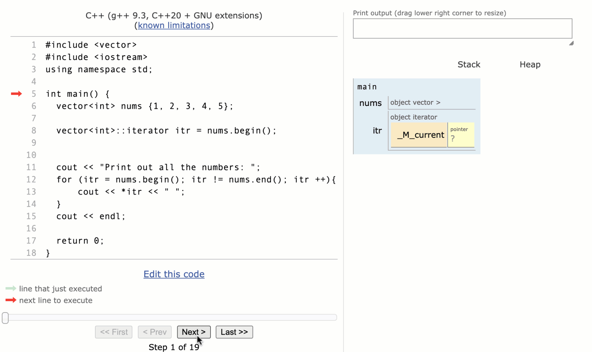

# Pairs and Iterators

Now we are going to start to look at associative data strucures. Unlike vectors, stacks, and queues, associative data structures are not stored in a particular order and cannot be accessed in an orderly fashion. Instead, they are accessed through keys and values as opposed to an index.

You can also access all the elements in an associative data structure by iterating through them, however since there is no index to access the values, you need to access in a different way using an iterator.

In this lesson, you are going to get a quick introduction to two elements that will be used to help with access to these associative data structures, pairs and iterators. You will then use these as you explore sets and maps later in the module.

## Pairs

A pair is exactly how it sounds, it is a pair of values. Pairs can be two values of the same type, but they can also contain values of a different type. Pairs are often used to hold two pieces of related data. You will see pairs used later in this module as you explore key/value pairs with maps.

### Creating Pairs

Pairs are part of the C++ standard library and do not need a special import statement.

To declare a pair, you use the keyword pair and specify the two types of variables inside angled brackets and then the variable name.

Basic Form:
```c++
pair<type1, type2> variableName;
```

Examples:
```c++
pair<string, string> address;
pair<string, int> nameAge;
pair<double, double> math;
```

When creating the pair, you can assign initial values by placing them inside curly brackets.

Examples:
```c++
pair<string, int> nameAge {"Karel", 9};
pair<double, double> math {5.3, 8.7};
```

### Accessing and Updating Values

Accessing and updating values is similar to how values are accessed and updated with a struct. With structs, you access the value with a dot and the member name. Since a pair doesn’t have member variables, you simply access using the keywords `first` and `second`.

Example:
```c++
pair<string, string> address {"Richardson", "TX"};

cout << address.first << endl;
cout << address.second << endl;
```
Output:
```
Richardson
TX
```
Updates are done using the same access.
```c++
pair<string, int> nameAge {"Karel", 9};
nameAge.second = 10;
```

### Using Pairs

Just like any other data structure, pairs can be used as a separate data structure or as part of another data structure. In this example, you can see how pairs can be used with a vector or a queue.

Examples:
```c++
vector<pair<string, int> > classRoster;
queue<pair<string, string> > names;
```
As mentioned above, pairs will be used for specific purposes in C++, like maps. Beyond that, pairs do have limited use since it can often be just as easy and more descriptive to create a struct. For example, if you wanted to store the first and last name, you can do this with a pair and then represent the first name in the first position and the last name in the second position.

Alternatively, you can create a `name` struct and give the member names more descriptive values such as firstName and lastName.

## [**Try This Example**](https://replit.com/@Poston/512-Pairs#main.cpp)

<iframe src="https://replit.com/@Poston/512-Pairs#main.cpp?embed=true" width="600" height="400" />

```c++
#include "util.h"

int main(){
    
	/* Pairs are a simple data structure that
	 * contain two values that may or may
	 * not be of the same type. The pair values
	 * do not necessarily need to be related.
	 */
	
	// Create with initial values
	pair<int, int> nums {5,3};
	
	// Access using the keywords first and second
	cout << nums.first << endl;
	cout << nums.second << endl;
	
	pair<string, int> dog;
	
	// Set values the same way you access them
	dog.first = "Spot";
	dog.second = 4;
	
	cout << dog.first << " is " << dog.second;
	cout << " years old." << endl;
	
	return 0;
}
```

## Iterators

Back in the Vectors lesson, you were briefly introduced to iterators. You saw how iterators could be used to set the position to insert into a vector. In this lesson, you will have a chance to explore iterators further in relation to vectors.

It is typical to use a standard `for` loop to iterate through a vector, however an iterator can also be used. It is important to take time to understand how iterators can be used to loop through all the values of a data structure because they will be the only option when we get to our associative data structures such as sets and maps.

### Creating the Iterator

When declaring the iterator, you need to reference the entire variable type and then a double colon `::` followed by the keyword `iterator`. You then assign it to the beginning of the data structure using the `begin()` command.

Here are a couple of examples:
```c++
vector<int> nums {1, 2, 3, 4, 5};

vector<int>::iterator itr = nums.begin();
```
```c++
vector<students> classRoster;

vector<students>::iterator itr = classRoster.begin();
```
The iterator variable name can be anything. In these examples, `itr` is used.

### Iterating Through a Data Structure

Using an iterator, you can make use of either a for loop or a while loop to iterate through the data structure such as a vector.

Take a look at the basic structure:
```c++
vector<int> nums {1, 2, 3, 4, 5};

for (vector<int>::iterator itr = nums.begin(); itr != nums.end(); itr ++) {
    // Loop code
}
```
You will notice that the structure is very similar to any other for loop iteration. You initialize a value, loop until a condition is met, and increment up.

(Oftentimes you may see the iterator declared before the for loop to help shorten the for loop line. Either way is acceptable.)

### Accessing Values Using the Iterator

As you iterate through the data structure, the iterator that you created actually points to the value each time through. To access that value, you need to use the dereference operator, `*`.

Take a look at the example below to see how this pointer works behind the scenes.



*Image courtesy of pythontutor.com*

In this example above, notice how the iterator points to each value in the vector in order. By using `*itr`, the program can access the value in the array to print it out.

Once the loop reaches the end of the vector, the for loop is complete and the loop ends.

The same loop can be completed as a `while` loop:
```c++
vector<int> nums {1, 2, 3, 4, 5};
vector<int>::iterator itr = nums.begin();

while (itr != nums.end()) {
    cout << *itr << " ";
    itr ++;
}
```
In this example, the iterator was incremented up by 1. It is possible to increment by something other than 1, however, caution needs to be used. Unlike other loops that loop while a value is less than another value, iteration loops are looping while a value does not equal another value. If you are not careful, you may end up passing the endpoint without equalling it.

If that happens, you will have an endless loop of printing out garbage! See this example at the bottom of this code.

### Removing Values from a Vector Using an Iterator

You can remove an element from a vector using the `erase` function of the `vector` class. The function requires an iterator pointing to the element to be removed.

An iterator pointing to the beginning of the vector by calling the `begin` function of the `vector` class.

Example:
```c++
vector<int> numbers {0, 1, 2, 3, 4};

// remove the element at index 2
numbers.erase(numbers.begin() + 2);

// numbers now contains {0, 1, 3, 4}
```

In the example above, an iterator pointing to the beginning of `numbers` was created with the call `numbers.begin()`. Then we just add the number of the index to be removed to advance the iterator. Finally, we can pass the iterator (already advanced to the correct position) to the `erase` function.

## [**Try This Example**](https://replit.com/@Poston/513-Iterators#main.cpp)

```c++
#include "util.h"
#include <vector>

int main(){
    
	/* Iterators are tools that can be used to
	 * iterate, or step through, a group of
	 * numbers. You can iterate through data
	 * structures like vectors, but sequential
	 * structures do not require an iterator.
	 * As you move into associative structures
	 * such as sets and maps, iterators will
	 * be required to iterate through the elements.
	 */
	 
	vector<int> nums {1, 2, 3, 4, 5};
	
	/* To create an iterator, you need to define
	 * it in terms of what you will iterate through.
	 */
	
	vector<int>::iterator itr = nums.begin();
	
	/* As you loop through the vector, the itr value
	 * points to the next element each time through
	 * the loop. We start at the begining, loop
	 * while you are not at the end, and increment
	 * each time.
	 *
	 * Since this is a pointer to the actual value
	 * and not the actual value, you need to use the
	 * dereference operator by adding a * before the 
	 * itr value. You will see more about pointers
	 * in a later unit.
	 */
	
	cout << "Print out all the numbers: ";
	for (itr = nums.begin(); itr != nums.end(); itr ++){
		cout << *itr << " ";
	}
	cout << endl;
	
	/* While iterators work great when visiting
	 * every number, they don't work well when you
	 * want to increment by something other than
	 * one.
	 * Try running the code below. There is a counter
	 * to make sure the code doesn't get stuck in
	 * an infinite loop.
	 */
	
	// What happens after it prints out the 5?
	int counter = 0;
	cout << "Print out every other number: ";
	for (itr = nums.begin(); itr != nums.end(); itr += 2){
		cout << *itr << " ";
		counter ++;
		if (counter > 10) break;
	}
	cout << endl;
	
	return 0;
}
```